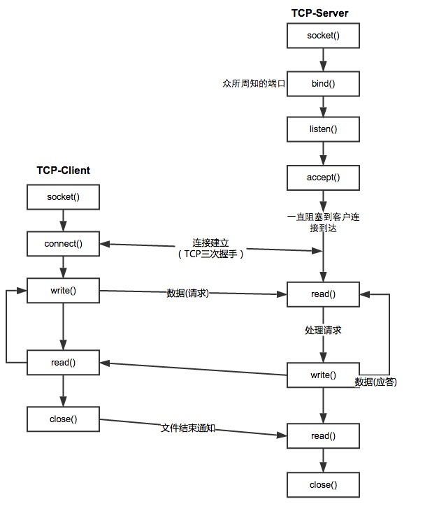

###1、init\_signal_handlers（信号量相关）

```c
void init_signal_handlers() {
    //SIGPIPE 写至无读进程的管道
    signal(SIGPIPE, SIG_IGN);
    //SIGINT 终端中断符,丽日DELETE+Ctrl_C
    signal(SIGINT,  SIG_IGN);
    //连接断开
    signal(SIGHUP,  SIG_IGN);

    //两个自定义
    signal(SIGUSR1, SIG_IGN);
    signal(SIGUSR2, SIG_IGN);
    //SIG_IGN specifies that the signal should be ignored
}
```

###2、network\_server\_start

**基本TCP客户/服务器程序的套接字函数**


上面这个结构对这块代码有很好理解作用。


####2.1 创建listten_socket
通过下面的函数进行listen_socket创建

```c
listen_socket = create_listen_network_socket(srv)
```

1. 从socket连接池中获取socket

```c
network_socket *s;
s = network_socket_get(srv->sockets_pool, 1)
```

这个函数先是从socket pool获取,如果获取不到再创建

```c
    network_socket *s = NULL;
    if (NULL == (s = network_socket_pool_get(pool))) {
        if (NULL == (s = network_socket_create())) {
           return NULL;
        }
    } 

//network_socket_pool_get实现方式
    network_socket *s = NULL;
    s = g_queue_pop_head(pool->sockets);
    s->use_times++;
    


```
**network\_socket\_create，初始化network_socket结构体**

```c
inline network_socket* network_socket_create() {

    network_socket *s = NULL;
    if (NULL == (s = calloc(1, sizeof(network_socket))) || NULL == (s->send_buf
                = byte_array_sized_new(SEND_BUF_DEFAULT_SIZE)) || NULL
            == (s->self_buf = byte_array_sized_new(SELF_BUF_DEFAULT_SIZE))
            || NULL == (s->cache_cmds = g_ptr_array_new()) || NULL
            == (s->prepare_read_array = g_array_new(FALSE, FALSE, sizeof(int)))
            || NULL == (s->prepare_write_array = g_array_new(FALSE, FALSE,
                    sizeof(int))) || 
                    NULL == (s->last_insert_id_array = g_array_new(FALSE, FALSE,sizeof(int)))
                    || NULL == (s->prepare_statement_ids
                = g_ptr_array_new())) {
        log_error(logger, "network_socket_create() failed not enough memory");
        network_socket_free(s);
        return NULL;
    }
    s->fd = -1;
    s->packet_len = -1;
    s->is_clean = 1;
    s->ms = MS_UNKNOWN;
    s->port = -1;

    s->statement_id = 0;

    s->query.qtype = -1;
    s->query.statement_id = -1;
    s->query_processed_num = 0;

    return s;
}
```

然后针对socket的类型，进行单独的socket初始化：

```c
//server
s->fd = socket(AF_INET, SOCK_STREAM, 0)
network_socket_put_back(s)
==>
network_socket_pool_add(s->srv->sockets_pool, s)

==>
//对network_socket每个结构体都进行初始化恢复设置
network_socket_reset(s)
g_queue_push_tail(pool->sockets, s)

//client
s->is_client_socket = 1;
s->packet_id = 0;
s->start_time = pool->srv->cur_time;


s->srv = pool->srv;
```

修改socket属性, 构建server:

```c
    //通过上面的部分完成socket创建，如下是修改这个属性
    setsockopt(s->fd, SOL_SOCKET, SO_REUSEADDR, &val, sizeof(val))
    struct sockaddr_in listen_addr;
    listen_addr.sin_family = AF_INET;
    listen_addr.sin_addr.s_addr = INADDR_ANY;
    listen_addr.sin_port = htons(srv->config->port);
    
    //bind
    bind(s->fd, (struct sockaddr *) &listen_addr, sizeof(listen_addr))
    
    //listen
    listen(s->fd, srv->config->backlog)
    
    //新修改socket属性
    set_fd_flags(s->fd)
    
    //network_server *srv属性
     srv->listen_socket = s;
     return s
```

mmap，buffered I/O, mmap, direct I/O 在I/O stack中的位置


mmap函数相关解释：

+ [mmap 详解](http://kenby.iteye.com/blog/1164700)
+ [http://myasuka.com/mmap-use/](http://myasuka.com/mmap-use/)


**构建mmap用于父子进程之间共享**：

```c
    srv->s1 = (status_user_and_ip*) mmap(NULL, sizeof(status_user_and_ip)
      * CONFIG_STATUS_MAX_PRODUCTUSER_NUM * CONFIG_STATUS_MAX_IP_NUM
      * srv->config->max_threads, PROT_READ | PROT_WRITE, MAP_SHARED
      | MAP_ANONYMOUS, -1, 0);

    srv->s2 = (status_dbip_and_user*) mmap(NULL, sizeof(status_dbip_and_user)
    * CONFIG_STATUS_MAX_PRODUCTUSER_NUM * CONFIG_STATUS_MAX_IP_NUM
     * CONFIG_STATUS_MAX_DB_NUM * srv->config->max_threads, PROT_READ
    | PROT_WRITE, MAP_SHARED | MAP_ANONYMOUS, -1, 0);

    srv->s3 = (status_mysql_proxy_layer*) mmap(NULL,
    sizeof(status_mysql_proxy_layer) * srv->config->max_threads,
    PROT_READ | PROT_WRITE, MAP_SHARED | MAP_ANONYMOUS, -1, 0);

    srv->s4 = (status_mmap_flag*) mmap(NULL,
    sizeof(status_mmap_flag) * srv->config->max_threads,
    PROT_READ | PROT_WRITE, MAP_SHARED | MAP_ANONYMOUS, -1, 0);
```

```

主进程和一个子进程有
status_user_and_ip  装了与用户名+ip相关的状态查询内容
status_dbip_and_user  装了与数据库IP和用户名相关的状态查询内容   
status_mysql_proxy_layer 封装了与MySQL Proxy Layer本身相关的状态查询内容
status_mmap_flag 
```


**创建工作线程**

```c
pid_t pids[srv->config->max_threads + 1];

for (pnum = 0; pnum < srv->config->max_threads; pnum++) {
	child_pid = child_make(pnum, listen_socket, srv,0);
	pids[pnum] = child_pid;
}

pid_t child_make(int pnum,
				   network_socket *listen_socket, 
				   network_server *srv,int is_zoo) {
    pid_t pid; 
    if (0 < (pid = fork())) {
        return pid; 
    }    
    if(is_zoo == 0){
        child_main(pnum, listen_socket, srv);
    } else {
        zk_process(pnum, listen_socket, srv);
    }    
    return 0;
}
	
```

**对于不使用zookeeper的方式(child_main)**

```c
poll = poll_create()
poll_events_add(poll, listen_socket, EPOLLIN)

while (1) {
	int fd_cnt = epoll_wait(epfd, events, event_size, EPOLL_TIMEOUT)
	
	if (1 == s->is_client_socket) { 
		process_ready_client_network_socket(srv, s, poll);
	}else{
		process_ready_server_network_socket(srv, s, poll);
	}
}

```

**Epoll-IO多路复用**
[Linux IO模式及 select、poll、epoll详解](https://segmentfault.com/a/1190000003063859)


