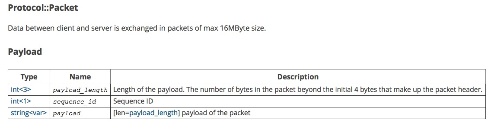

### 1、MySQL Socket协议

####1、1 MySQL的Server发给Client的协议包解析

[MySQL协议:建立Socket连接](https://github.com/guimingyue/guimingyue.github.io/blob/00628bf867e014796012970cb52b8e711d4205d5/_posts/2015-04-08-mysql_protocol_connect.md)

在函数process\_ready\_client\_network\_socket中第一个步骤是和mysql构建连接，这里面涉及到mysql soket通信协议。


```c
1277     case STATE_CONNECTED_CLIENT:
1278         switch (ret = handshake_send(s)) {
1279         case RET_SUCCESS:
1280             s->state = STATE_SEND_HANDSHAKE;
1281             poll_events_mod(poll, s, EPOLLIN);
1282             break;
1283         case RET_WAIT_FOR_EVENT:
1284             poll_events_mod(poll, s, EPOLLOUT);
1285             break;
1286         default:
1287             log_warning(logger, "handshake_send return error default client_fd=%d,
						   state=%d,ret=%d, errno=%d, error: %s",
						    s->fd, s->state,ret, errno, strerror(errno));
1288             client_free(s, 0);
1289             break;
1290         }
1291         break;
```

**handshake_send**

**<font color='red'>问题是这里的handshaker是dbproxy的server给client的，还是client发给dbproxy的server呢，一直开始没有搞清楚这个问题。</font>**

```c
2376     const unsigned char packet_handshake[] = "\x0a" /* protocol version */
2377         "5.0.51b\x00" /* server version */
2378         "\x01\x00\x00\x00" /* thread id */
2379         "\x2f\x55\x3e\x74"
2380         "\x50\x72\x6d\x4b" /* scramble_buf */
2381         "\x00" /* filter */
2382         "\x0c\xa2" /* server capabilities */
2383         "\x1c" /* server language encoding :cp 1257 change to gbk*/
2384         "\x02\x00" /* server status */
2385         "\x00\x00\x00\x00"
2386         "\x00\x00\x00\x00"
2387         "\x00\x00\x00\x00"
2388         "\x00\x56\x4c\x57"
2389         "\x54\x7c\x34\x2f"
2390         "\x2e\x37\x6b\x37"
2391         "\x6e\x00";
2392     if (RET_SUCCESS != (ret = network_queue_send_append(s->send_buf,
2393             packet_handshake, (sizeof(packet_handshake) - 1), 0, 0))) {
2394         return ret;
2395     }
```

packet_handshake是按照mysql socket V10版本通信协议来的。

<font color='green'>**分析方向**</font>

这里是client的socket，是发给连接上来的客户端的。
可以通过模拟登陆mysql的情况，在connect的mysql之后，mysql的server发过来的包。

[通过wireshark分析的MySQL协议的demo](https://github.com/siddontang/mixer/blob/master/doc/protocol.txt)



下面是这个payload的结构，**[初始化握手报文](http://dev.mysql.com/doc/internals/en/connection-phase-packets.html#packet-Protocol::Handshake)**：

```
1              [0a] protocol version
string[NUL]    server version
4              connection id
string[8]      auth-plugin-data-part-1
1              [00] filler
2              capability flags (lower 2 bytes)
  if more data in the packet:
1              character set
2              status flags
2              capability flags (upper 2 bytes)
  if capabilities & CLIENT_PLUGIN_AUTH {
1              length of auth-plugin-data
  } else {
1              [00]
  }
string[10]     reserved (all [00])
  if capabilities & CLIENT_SECURE_CONNECTION {
string[$len]   auth-plugin-data-part-2 ($len=MAX(13, length of auth-plugin-data - 8))
  if capabilities & CLIENT_PLUGIN_AUTH {
string[NUL]    auth-plugin name
  }
```


**连接mysql的代码**

使用下面的C语言代码[connect_mysql](https://github.com/dolphinsboy/dbproxy/tree/master/connect_mysql)，完成连接mysql的协议解析：

```
connect result:0
#从mysql获取到的协议包
\x4e\x0\x0\x0
\xa
\x35\x2e\x36\x2e\x32\x37\x2d\x6c\x6f\x67\x0
\xffffffbb
\x0\x0\x0\x30\x3f\x2a\x55\x50\x6d\x55\x42\x0
\xffffffff\xfffffff7
\x2d\x2\x0\x7f
\xffffff80\x15\x0\x0\x0\x0\x0\x0\x0\x0\x0\x0\x2b\x4f\x2e\x37\x67\x22\x6f\x2d\x30\x46\x52\x4b\x0
\x6d\x79\x73\x71\x6c\x5f\x6e\x61\x74\x69\x76\x65\x5f\x70\x61\x73\x73\x77\x6f\x72\x64\x0

ProtocolVersion= 10
ServerVersion  = 5.6.27-log
ConnectionId   = 187
Auth-plugin-data-part-1 = 0?*UPmUB
Auth-plugin-data-part-2 = +O.7g"o-0FRK
Auth-plugin-name = mysql_native_password
```


**Note**
由于经常需要使用到字符和16进制之间的转换，这里罗列一些python函数：

```python
##字母转换为16进制
>>> hex(ord('d'))
'0x64'
>>> hex(ord('m'))
'0x6d'

##16进制转换为字母
>>> print '%c' % int('0x64',16)
d

##数字转换为16进制
>>> hex(100)
'0x64'
```

基于上面的写了一个转换的python脚本：

```python
[guosong@dev-00 code]$ more conver.py 
#!/usr/bin/env python
#-*- coding:utf8 -*-
import os
import sys

def conver(in_str):
    input_list = in_str.split("\\x")[1:]

    convert_list = []
    for byte in input_list:
        convert_list.append('%c' % int(byte,16))

    print ''.join(convert_list)


if __name__ == '__main__':

    in_str = ''.join(sys.argv[1:])
    ret = conver(in_str)

[guosong@dev-00 code]$ ./conver.py "\x00\x56\x4c\x57"
 "\x54\x7c\x34\x2f" "\x2e\x37\x6b\x37"  "\x6e\x00"
 
VLWT|4/.7k7n
[guosong@dev-00 code]$ ./conver.py "\x2f\x55\x3e\x74" 
 "\x50\x72\x6d\x4b"         
                   
/U>tPrmK
```

使用上面脚本可以解析出来：

```
N
5.6.27-logmC`;D$'6y-
```

####1、2 MySQL的Client回复给Sever的协议包解析

4.1+ clients  使用HandshakeResponse41协议回复Server的数据包。
